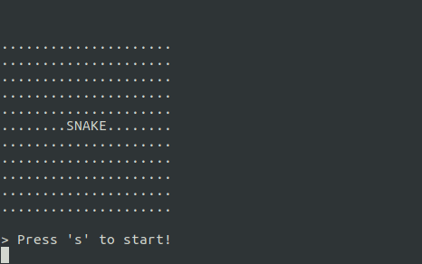

# purescript-marionette.snake-demo

A snake implementation written with [purescript-marionette](https://github.com/thought2/purescript-marionette)

## Run

```
$ git clone https://github.com/thought2/purescript-marionette.snake-demo snake
$ cd snake
$ spago run
```

